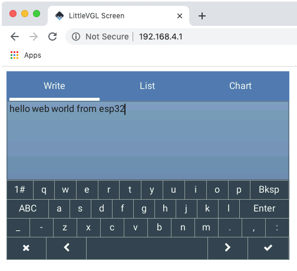

# LittleVGL ESP32 websocket driver

A websocket driver allowing LittleVGL to display in a web browser via WiFi.  LittleVGL screen region refreshes are sent via a websocket to a simple web page containing a canvas and mouse/touch events are returned via the websocket back to the ESP32.  Multiple sessions are possible with the display updated on all browsers simultaneously (within memory constraints of the ESP32).


This repository is based on the LittleVGL [ESP32 demo repository](https://github.com/littlevgl/lv_port_esp32) as of early 2020 (lvgl v6.0).

## Wait, WTF!?!, why not just a "real" web page?
This is not, I admit, the most efficient way to render something on a web browser.  It's noticeably slow when using 32-bit pixels, a background image like the bubbles in the lvgl demo and transparency, but it's not bad when just refreshing controls and provides a way to easily extend your device into web space while using the same awesome GUI library you use for a local LCD display.  In fact, you could write an application that could display the same GUI, using the same code, on a local LCD or a remote web browser.  That's a little useful I think.

If you agree, read on...

## Get started 
### Install the ESP32 SDK


This project should be compatible with both the ESP-IDF 3.X branch and the 4.0 branch, although I built with v3.3 and used make. You should also be able to use CMake with the 4.0 branch.

Read about installing the ESP32 SDK at their [website](https://esp-idf.readthedocs.io/en/latest/).

Read general instructions, including those for the ESP-IDF 4.0 branch at the LittleVGL demo repository above.

#### ESP32 compatibility
This project should run on any ESP32 board as it requires no peripherals.

### Build this repository and run the demo.

Get this project via zip download or git.
	`git clone --recurse-submodules https://github.com/danjuio/lv_port_esp32_web.git`

The project should compile and run on your board with only one change to select your specific serial/com port.

Change to the project directory and use menuconfig (`make menuconfig` or `idf.py menuconfig`) to set your port.


I also changed from the default download speed of 115200 baud to 921600 baud because the project results in a pretty large binary.

Save the changes and build the project (`make` or `idf.py build`).  Once it has successfully built, load it and run (`make flash monitor` or `idf.py -p (SERIAL PORT) flash` followed by `idf.py -p (SERIAL PORT) monitor`).

You should see a new WiFi appear with an SSID of `web_lvgl`.  Connect to this (default password `password`) and browse to 192.168.4.1.  You should be rewarded by the LVGL Demo screen!




## Project notes
* The driver is contained in `components/lvgl_esp32_drivers/websocket_driver`.

* The webpage `index.html` and a favicon are stored as binary objects in the program and served to requesting browsers from the driver.  See the `component.mk` and `CMakeLists.txt` files in the driver sub-directory.  The webpage is simply a carrier for the javascript that unpacks pixel data for the canvas and packs input events for the driver.

* The project makes use of a modified copy of Blake Felt's [ESP32 Websocket](https://github.com/Molorius/esp32-websocket).  Many thanks to Blake, not only for his code but for some of the cool techniques he used.  To improve performance (eliminating data copies) I wrote my own binary websocket send function.  To do this I needed access to some variables in his websocket server so I changed those from static to publicly visible.  I also wrote the missing binary websocket send functions in his header file but ended up not using them.

* The websocket payload sent from the driver to the webpage consists of the following fields.

	```
	Byte  0: Pixel Depth (8, 16 or 32)
	Byte  1: Canvas Width[15:8]
	Byte  2: Canvas Width[7:0]
	Byte  3: Canvas Height[15:8]
	Byte  4: Canvas Height[7:0]
	Byte  5: Redraw Region X1[15:8]
	Byte  6: Redraw Region X1[7:0]
	Byte  7: Redraw Region Y1[15:8]
	Byte  8: Redraw Region Y1[7:0]
	Byte  9: Redraw Region X2[15:8]
	Byte 10: Redraw Region X2[7:0]
	Byte 11: Redraw Region Y2[15:8]
	Byte 12: Redraw Region Y2[7:0]
	Byte 13-N: Pixel data (high-byte first for 32- and 16-bit pixels)
	```

* The websocket payload sent from the webpage to the driver consists of the following fields.

	```
	Byte 0: Flag (Touch = 1, Release = 0)
	Byte 1: Pointer X[15:8]
	Byte 2: Pointer X[7:0]
	Byte 3: Pointer Y[15:8]
	Byte 4: Pointer Y[7:0]
	```

* The driver supports 8-bit, 16-bit, and 32-bit pixels with each increase in pixel depth requiring twice the number pixel data bytes (and corresponding slow-down).  Pixel depth is configured in the LittleVGL configuration file (`components/lvgl/lvgl.conf`).

* The driver should support any resolution (16-bits).  Resolution is also configured in the LittleVGL configuration file.  This project's resolution is 480x320 pixels.

* The project uses the dual display buffer technique described in the LittleVGL [Display porting guide](https://docs.littlevgl.com/en/html/porting/display.html).  This allows it to prepare one buffer while the other is being displayed.  LittleVGL updates the display in regions that have changed.  The maximum amount of area to be updated at a time is controlled by the `DISP_BUF_SIZE` define in `websocket_driver.h`.  This is very important because it is directly related to a memory buffer that has to exist (I statically allocate this buffer in the driver).  The buffer holds pixels (1, 2 or 4 bytes per pixel).  Too large a value and the ESP32 will crash or the build will fail with a memory-overflow.  The driver currently specifies this as a number of lines.  That means that increasing the display width will increase the memory required.  If things go boom, this is a place to reduce your memory use.

* The driver supports multiple (current maximum = 4) simultaneously connected browsers.  It will update all and take input from all although sending input from more than one browser at a time will currently confuse the driver (and LittleVGL).  The driver forces LittleVGL to invalidate the screen whenever a new session is attached.  This forces it to repaint the entire screen so the new session has a valid starting point.  The maximum number of supported connections is set by a configuration item in the websocket configuration available from menuconfig.  From the main menuconfig screen, select `Component Config` and then select `Websocket Server`.


* You can change the title of the web page, for example to set the name of your program, in the `index.html` file.  You can also change the 16x16 pixel favicon using any number of programs to generate a `favicon.ico` file.

* The way to improve performance is to reduce the amount of redrawing LittleVGL has to do.  8-bit pixels are the fastest but limit you to 256 colors.  16-bit pixels, typically used with low-cost LCD displays, are a bit slower but present a good visual image.  32-bit pixels are possible but you want to eliminate backgrounds and things like animations that cause LittleVGL to have to refresh large portions of the screen at a time.

## Questions?

Contact the author -- dan@danjuliodesigns.com
